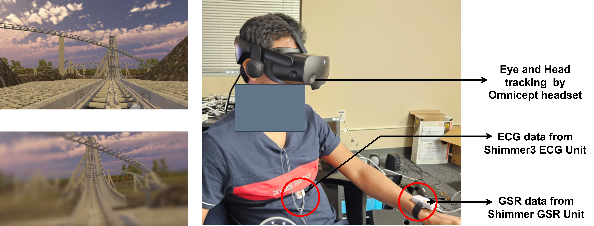
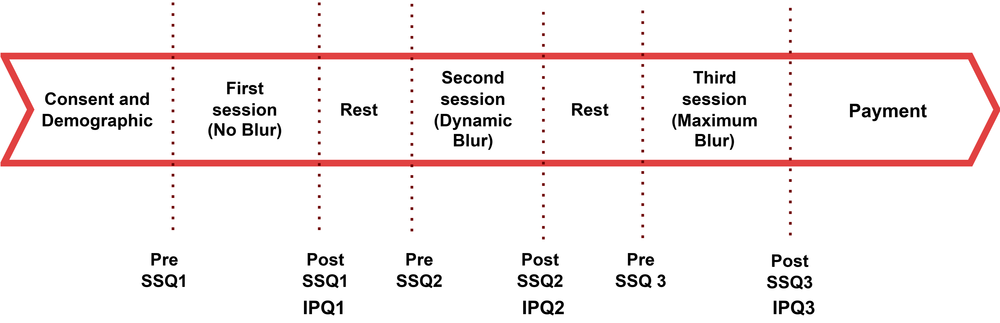

# Cybersickness Dataset with Real-Time Reduction Techniques

## Overview

This dataset is derived from a controlled study on **cybersickness in virtual reality (VR)** environments. It is designed to support research into **real-time visual comfort techniques** by providing multimodal data collected during immersive VR experiences under different visual conditions.

- **Study Focus**: Real-time reduction of cybersickness using dynamic blur techniques.
- **VR Environment**: Roller coaster simulation designed to induce motion-related discomfort.
- **Dataset Access**: [Google Drive Link](https://drive.google.com/file/d/1PKDxODr1tlMKOxT9dF4v5fV2VwJogKiw/view?usp=sharing)

---

## Participants

- **Total Participants**: 38  
  - 21 Male (55.3%)  
  - 17 Female (44.7%)  
- **Age Range**: 18 – 59 years  
  - Mean Age: 26.3 years (SD = 7.2)
- **Recruitment**: From two universities, including students and members of the general public

### Demographics

- **VR Experience**:  
  - 44.7% Never used  
  - 44.7% Rarely used  
  - 5.3% Occasionally  
  - 5.3% Frequently  

- **Gaming Experience**:  
  - Mean score: 3.3 (SD = 1.4) on a 5-point scale

## Methodology of Data collection

This dataset was generated through a controlled experimental study designed to evaluate **real-time mitigation techniques for cybersickness** in virtual reality (VR). A preliminary **pilot study** involving 14 participants allowed individuals to manually adjust the visual blur level during a 3-minute VR roller coaster simulation, while self-reporting **Fast Motion Sickness (FMS)** scores every 30 seconds. Since participant responses lacked consistency, a **linear blur mapping strategy** was implemented in the main study — for example, an FMS score of 7 would result in a blur intensity of 70%.

The main study included **38 participants**, each exposed to three **counterbalanced experimental conditions**:

1. **No Blur (Condition A)**: VR simulation with blur intensity fixed at 0%.
2. **Dynamic Blur (Condition B)**: Blur level adjusted in real-time based on FMS scores (e.g., FMS 7 = 70% blur).
3. **Static Maximum Blur (Condition C)**: Constant blur intensity fixed at 100% for the entire session.

Each VR session lasted approximately **3 minutes**. During these sessions, the following data types were collected:

- **Subjective Ratings**:
  - **Simulator Sickness Questionnaire (SSQ)** – before and after each session
  - **Fast Motion Sickness Scale (FMS)** – every 30 seconds during VR
  - **Igroup Presence Questionnaire (IPQ)** – post-session

The **VR environment** was a roller coaster simulation built in Unity, adapted from a prior study by Islam et al. Each ride cycle lasted about 57 seconds with a 10-second break before repeating. While users could freely look around, the roller coaster path was fixed and non-interactive.

A key innovation in this study was the use of **Foveated Gaussian Blur**, which varies blur intensity based on distance from the user’s gaze. This approach maintains clarity in central vision while blurring the periphery to reduce sensory overload and mitigate cybersickness. Blur levels were adjustable via keyboard or controller, mapped to keys 0–9 (with `-` representing maximum blur at 1.0).

All sessions were conducted using high-fidelity hardware:
- **VR Headset**: HP Reverb Omnicept G2 (2160×2160 resolution)
- **Physiological Sensors**: Shimmer3 ECG and GSR units

Participants completed an IRB-approved informed consent process, received rest breaks between conditions, and were compensated **$30/hour** with parking validation provided.
The following diagram provides an overview of the experimental flow:

## Data Collected

### Physiological Data

| Signal | Device | Sampling Rate |
|--------|--------|----------------|
| ECG (heart activity) | Shimmer3 ECG | 512 Hz |
| GSR (skin conductance) | Shimmer GSR | 128 Hz |

### Tracking Data

| Signal | Source | Sampling Rate |
|--------|--------|----------------|
| Eye and head Tracking | HP Reverb Omnicept | 120 Hz |

Includes:
- Gaze position
- Pupil dilation
- Head orientation and position

---

## Equipment

| Equipment | Details |
|----------|---------|
| VR Headset | HP Reverb Omnicept G2 |
| Display | 2160×2160 pixels per eye @ 90 Hz |
| Built-in Tracking | Eye and head tracking |
| Sensors | Shimmer3 ECG & GSR units |

## Dataset Folder Structure

Data was collected from 2 different university which is given in 2 folder -Uni 1 data and Uni 2 data. SSQ folder in github has pre and post SSQ for both universities.
